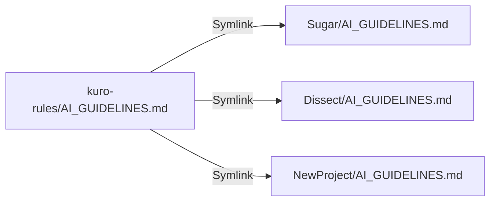

# Kuro Rules ⬛

Centralized AI coding guidelines and configuration for all my projects.

## How It Works (Symlinks)

This repository contains the **master copies** of your rules.
When you run the install script, we create **symbolic links** (symlinks) in your target project pointing back here.



**Benefit:** Edit `kuro-rules/AI_GUIDELINES.md` once, and **ALL** projects are instantly updated.

## Usage

### On Linux / macOS / WSL (Recommended)

1. **Install in a project:**
   ```bash
   ~/Documents/kuro-rules/install.sh /path/to/my-project
   ```

2. **Update all projects:**
   Since they are symlinks, just edit the files in this repo!

### On Windows (PowerShell)

If you are using native Windows (not WSL), symlinks behave differently.
You should check out this repo to `C:\Users\kuro\Documents\kuro-rules`.

**Option A: Junctions (Recommended for Windows)**
Windows "Junctions" or "Soft Links" work similar to Linux symlinks.
You can create a `install.ps1` script (coming soon) or use:
```powershell
New-Item -ItemType SymbolicLink -Path "C:\Path\To\Project\AI_GUIDELINES.md" -Target "C:\Path\To\kuro-rules\AI_GUIDELINES.md"
```

**Option B: Copy Mode**
If symlinks give you trouble on Windows, you can simply *copy* the files. The downside is you lose the "update once, update everywhere" feature.

## New Machine Setup

1. Clone this repo:
   ```bash
   git clone https://github.com/yourusername/kuro-rules.git ~/Documents/kuro-rules
   ```
2. Run `install.sh` on your existing projects.

## The Rules

- **AI_GUIDELINES.md**: High-level principles (Security, Quality, Architecture).
- **.cursorrules**: Instructions for Cursor AI.
- **.pre-commit-config.yaml**: Standard git hooks (linting, security).
- **copilot-instructions.md**: Instructions for GitHub Copilot.
