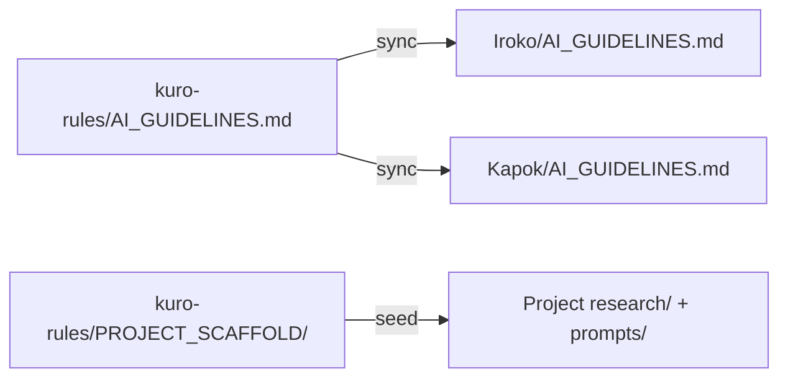

# Kuro Rules

Centralized AI coding guidelines, project isolation rules, and validation scaffold for all my projects.

## How it works

This repository contains the master copies of the shared rules.
When you install into a project, the core rule files are linked or copied into that project and the project also receives a local validation scaffold.


```mermaid
graph LR
    A["kuro-rules/AI_GUIDELINES.md"] -->|sync| B["Iroko/AI_GUIDELINES.md"]
    A -->|sync| C["Kapok/AI_GUIDELINES.md"]
    D["kuro-rules/PROJECT_SCAFFOLD/"] -->|seed| E["Project research/ + prompts/"]
```

Benefit: edit `kuro-rules` once, then resync every project from the same source of truth.

## Usage

### Linux / macOS / WSL

Install in one project:

```bash
~/Documents/kuro-rules/install.sh /path/to/my-project
```

Resync all known projects:

```powershell
pwsh ~/Documents/kuro-rules/sync-rules.ps1 -Force
```

### Windows PowerShell

Install in one project using copy mode:

```powershell
.\install.ps1 -TargetDir "C:\Path\To\Project"
```

Install with symbolic links:

```powershell
.\install.ps1 -TargetDir "C:\Path\To\Project" -UseSymlinks
```

Resync all known projects:

```powershell
.\sync-rules.ps1 -Force
```

## New machine setup

1. Clone this repo:

```bash
git clone https://github.com/yourusername/kuro-rules.git ~/Documents/kuro-rules
```

2. Run `install.sh` or `install.ps1` on your existing projects.

## Shared files

- `AGENTS.md`: full operating contract and enforcement rules.
- `AI_GUIDELINES.md`: high-level principles for security, quality, and architecture.
- `GAD.md`: global AI directives and rule summary.
- `.cursorrules`: Cursor-specific instructions.
- `copilot-instructions.md`: source file synced into `.github/copilot-instructions.md`.
- `.pre-commit-config.yaml`: standard git hooks.
- `MARKETING_MEMORY/`: master due-diligence prompt templates.
- `PROJECT_SCAFFOLD/`: local prompts, staged `research/` files, and `decision-memo.md`.


## Canonical path policy

`copilot-instructions.md` in this repository is the master source file.
In projects, the canonical installed location is:

- `.github/copilot-instructions.md`

The repository root copy is considered legacy only and should not exist in synced projects.
The install and sync scripts are expected to remove a redundant root copy automatically when it is byte-identical to the canonical `.github` copy. If the two files differ, the scripts must warn instead of deleting.

## Audit

Run the audit to detect:

- missing repositories listed in `projects.txt`
- rule file drift
- missing rule numbers in `AGENTS.md`
- unexpected root-level `copilot-instructions.md` files
- non-canonical Copilot instruction placement

Linux / macOS / WSL:

```bash
python ~/Documents/kuro-rules/audit-rules.py
```

Windows PowerShell:

```powershell
python .udit-rules.py
```

### Canonical file map

The shared AI rule system uses the following canonical file map:

- `AGENTS.md` -> project root `AGENTS.md`
- `AI_GUIDELINES.md` -> project root `AI_GUIDELINES.md`
- `GAD.md` -> project root `GAD.md`
- `.cursorrules` -> project root `.cursorrules`
- `copilot-instructions.md` -> project `.github/copilot-instructions.md`

Notes:
- `copilot-instructions.md` stored in `kuro-rules` is the master source file.
- A root-level project `copilot-instructions.md` is legacy only and should not exist.
- Sync logic and audit logic must enforce this map consistently.

### Audit modes

The audit supports two execution modes:

- `--mode repo`: validates the current `kuro-rules` repository itself.
  This is the correct mode for:
  - pre-commit
  - CI
  - pull request validation

- `--mode workspace`: validates all repositories listed in `projects.txt`
  under the workspace base directory. This is the correct mode for local
  machine-wide synchronization checks.
  Untracked git repositories discovered under the base directory are reported as NOTICE entries so they remain visible without failing the audit.

Examples:

Linux / macOS / WSL:

```bash
python ~/Documents/kuro-rules/audit-rules.py --mode repo --scope all
python ~/Documents/kuro-rules/audit-rules.py --mode workspace --scope all
```

Windows PowerShell:

```powershell
python .\audit-rules.py --mode repo --scope all
python .\audit-rules.py --mode workspace --scope all
```

### projects.txt policy

`projects.txt` is the authoritative list of tracked repositories for
workspace-wide synchronization.

Rules:
- every listed project must exist
- duplicate entries are forbidden
- stale or deleted repositories must be removed promptly
- workspace-wide audit should fail if a listed repository is missing
- repo mode must not depend on external sibling repositories
- sync-rules.ps1 must sync only repositories listed in `projects.txt`
- untracked git repositories under the workspace must be reported as NOTICE only and must not be synced implicitly

## Project scaffold

Every installed project gets:

- `prompts/perplexity.md`
- `prompts/grok.md`
- `research/README.md`
- `research/evidence-matrix.csv`
- `research/scorecard.md`
- `research/open-questions.md`
- `decision-memo.md`

The scaffold is organized around staged validation:

1. `L0` problem hypothesis
2. `L1` desk evidence
3. `L2` expert confirmation
4. `L3` pilot-ready offer
5. `L4` willingness-to-pay proof

Private notes, raw interviews, and contact lists are ignored by default through a managed `.gitignore` block and `research/.gitignore`.
