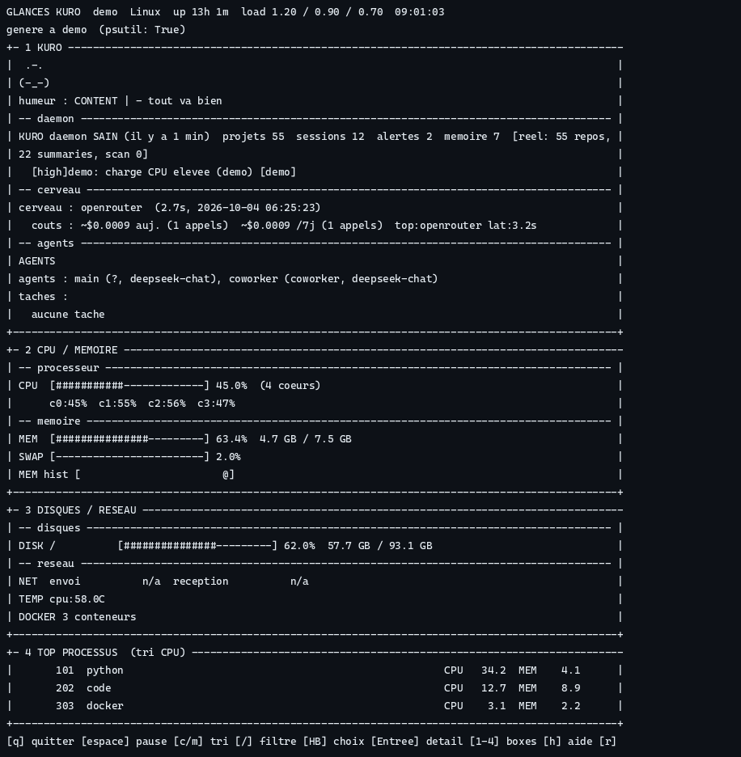

# kuro-dashboard

Glances Kuro as an installable package: a localhost REST API plus a web
dashboard showing live host pressure (CPU, memory, disks, network, GPU,
Docker, top processes) and Kuro project data from `~/.kuro/kuro.db`.



```bash
pip install kuro-dashboard[full]
kuro-dashboard --port 8767
# open http://localhost:8767
```

## Terminal UI (no browser needed)

```bash
xenon                         # ASCII live view, zero extra dependency
xenon-tui                     # rich Textual view (needs [textual] extra)
kuro-system --projects        # git sensing: repos under KURO_PROJECTS_ROOTS
```
Anciens noms `kuro-glances` / `kuro-glances-tui` : alias dépréciés.

Keys in `xenon`: `q` quit, `space` pause, `c`/`m` sort by CPU/MEM,
`/` filter processes, `r` refresh, `+`/`-` speed. Wide terminals (>=150
columns) get a sidebar (mood, brain + LLM costs, daemon). Long lines are
always cut to the terminal width, the footer sticks to the bottom.

No Kuro database? The TUI falls back to generic git sensing
(`KURO_PROJECTS_ROOTS`, defaults to `~/repos` then `~/Documents`) and shows
`PROJETS git : N (M dirty)`. No Kuro files, no daemon required.

## Docker

```bash
docker build -t kuro-dashboard -f packaging/docker/Dockerfile .
docker run --rm -p 8767:8767 kuro-dashboard
# open http://localhost:8767 — /api/system works without any database
```

Notes:

- The PyPI name is `kuro-dashboard` because `kuro` was already taken on PyPI
  by an unrelated 2018 project. The product itself is still called Kuro.
- The API binds `127.0.0.1` only. For remote viewing use an SSH tunnel:
  `ssh -N -L 8767:localhost:8767 user@host`.
- Full project panels (repo mesh, robot, finance) need a Kuro checkout and
  its database; system live works everywhere. Optional metrics need `psutil`
  (`pip install kuro-dashboard[full]`).
- The Kuro daemon itself lives in a separate repository and is installed
  with `pip install git+https://github.com/Lemniscate-world/Kuro`
  (or bundled in the `kuro` .deb package).
